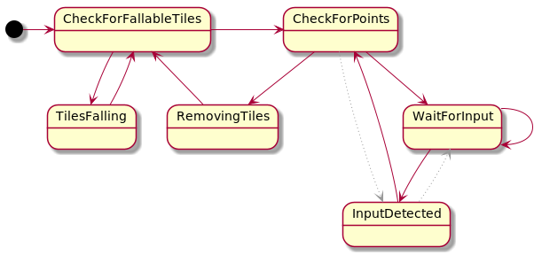
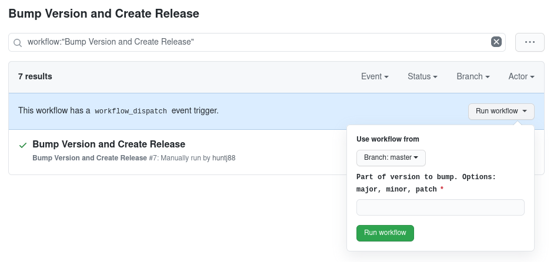

[](https://github.com/huntj88/TileGame/actions)

# App 
<a href="https://play.google.com/store/apps/details?id=me.jameshunt.tilegame"></a>

Quick sliding tile app to play around with some Finite State Machine concepts. 
The game state itself is represented with immutable data structures.
The custom view has a grid of falling tiles that will always fall down according to gravity (rotate/tilt phone).
If more than 3 (adjustable) tiles of the same color are in a row, then remove the tiles

# Motivation
Back in 2014 I had written something similar to this in 8 or so months in my spare time. 
That project was the really old project I liked to show people, both because it was pretty polished 
from a usability standpoint, but also because the code was just BAD. Comparing our old terrible code 
was something that I had done a handful of time with friends/coworker.

After one of these occasions of showing my coworkers, I wondered how long it would take to reimplement the 
parts that I struggled with the first time. Three days later I had reimplemented the core functionality 
that I wanted, although nowhere near "parity". Development since then has gone in a different direction.

<table>
  <thead>
    <th>Old Implementation</th>
    <th>New Implementation</th>
  </thead>
  <tr>
    <td>
        The old version had probably 60+ mutable variables in a "god" object that resulted in everything 
        getting tangled together with side effects to update these mutable variables. 
        There was very little separation of concerns. Its a wonder I got it working at all.
    </td>
    <td>
        The new version had only a handful of mutable variables and the rest of the logic was driven by an 
        extremely simple Finite State Machine. <b>Now the code is much shorter, and much easier to think about.</b>
    </td>
  </tr>
</table>

#### My initial goal was completed. Since then I have added:
- Fall direction of tiles based on gravity (tilt and rotation of the phone)
- Removed most of the remaining mutable variables and refactor to have the state machine progress with 
  immutable data structures
- Added a CI/CD pipeline to upload release builds to google play
- Config dialog

# Finite State Machine


The state machine loops infinitely on a background thread. Each iteration would increment the *tick* by 1.

For every tick that happens, the current state is taken as an input,
a new state is computed from the old state, but advanced 1 tick further ahead in time.

#### Looping speed
By running the state machine on a background thread, the rate at which we progress through the 
state machine can be fine tuned. We can run it as fast or as slowly as we want to without the UI having to know about this process.

If we loop really slowly the UI will only update as fast as we give it new states to render.

If we loop really fast the UI will only render a portion of the frames without constraining the state machines ability to keep going.

# Fun challenge after initial plan finished
All of my logic for the tiles falling was written with the assumption that tiles fell to the bottom of 
the screen, and new tiles would always fall from the top. To give myself a new challenge I would attempt to
take the Earth's gravity into account for tile fall direction so that down was actually down. This also meant down could be top 
of the screen, or the sides. It would no longer be restricted to to one fall direction.

#### Solution
I came to the realization that I didn't really need to change my logic at all. All that was actually 
needed was for me to transform the grid in a specific way for each fall direction before passing the 
result into my "fall from top only" logic. I was able to keep 95% of my existing tile grid logic.

Before executing some of the grid logic in a few key places, I would call `alignTilesByFallDirection()`
```kotlin
fun List<List<Tile?>>.alignTilesByFallDirection(directionToFallFrom: FallFromDirection): List<List<Tile?>> {
    // all logic was originally assumed to have tiles fall from the top of the grid
    // this manipulates the board so the same logic can be applied when tiles fall from a different direction

    // applying alignTilesByFallDirection() twice will give you the original value
    // https://en.wikipedia.org/wiki/Involution_(mathematics)

    fun List<List<Tile?>>.flipAlongYEqualsNegativeX(): List<List<Tile?>> = this
        .transpose2DTileList()
        .map { it.reversed() }
        .reversed()

    return when (directionToFallFrom) {
        FallFromDirection.Top -> this
        FallFromDirection.Bottom -> this.map { it.reversed() }
        FallFromDirection.Left -> this.transpose2DTileList()
        FallFromDirection.Right -> this.flipAlongYEqualsNegativeX()
    }
}
```

# Configurable variables:
If new config variables are set, they will be applied in the next tick 
|Name|Default|Description|
-|-|-
numTilesSize | 8 | Number of tiles across the grid is
numTileTypes | 3 | Number of unique tile types, currently represented with a solid color
numToMatch | 3 | Number of consecutive tiles of same type to be considered a match
milliToSleepFor | 16 | Number of milliseconds to put thread to sleep for
sleepEveryXTicks | 1 | Number of ticks that occurs until thread sleep

# Code Style
- The keyword `val` and immutable data structures are preferred.
- The keyword `var` should only be used in pure functions, except when representing external user input.
- Mutable data structures are only to be used in pure functions that do not manipulate outside state.

# Tests
The Game state is completely decoupled from the UI, which enables us to write unit tests where we 
setup the board in a specific way. Testing is as easy as asserting the expected state of the board 
after the state has been progressed a known number of times.

# CI/CD setup
Any commits to the master branch, or any PR's that are opened will automatically build the app and run unit tests.

#### Creating a new release - master branch only
There is a manual trigger to create a new release. This includes incrementing the version and 
tagging it, as well as uploading the signed app bundle to google play.



The trigger has a required field that must be one of: `major`, `minor`, `patch`.
This value is used to increment the corresponding part of the canonical version

#### Release Trigger Action Steps:
1. Checkout master branch
2. Validate release trigger input
3. Build And run unit tests
4. Tag with a new version number
5. Assemble Android app Bundle
6. Sign the bundle with the release key
7. Upload to Google Play console and publish on internal track
