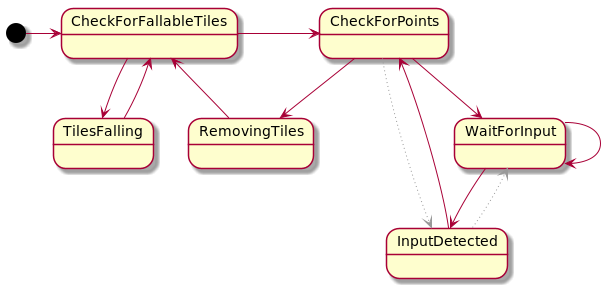

# App
The custom view has a grid of falling tiles that will always fall down according to gravity (rotate/tilt phone).
If more than 3 (adjustable) tiles of the same color are in a row, then remove the tiles
#### Configurable variables:
    1. numTilesSize:    defualt 8   Number of tiles across the grid is
    2. numTileTypes:    default 3   Number of unique tile types, currently represented with a solid color
    3. numToMatch:      default 3   Number of consecutive tiles of same type to be considered a match

# Code
Quick sliding tile experiment app to play around with some state machine concepts.
Written in a functional style with immutable data structures to hold game state

# CI/CD setup
When a new commit is added to the master branch a github action for deploying to Google Play is started.
#### Action Steps:
    1. Checkout master branch
    2. Build And run unit tests
    3. Tag with a new version number
    4. Assemble Android app Bundle
    5. Sign the bundle with the release key
    6. upload to Google Play console and publish on internal track

Building and testing also takes place when a pull request is opened

# State Machine

For every 'tick' that happens, the current state is taken as an input,
a new state is computed from the old state, but advanced 1 tick further ahead in time.
